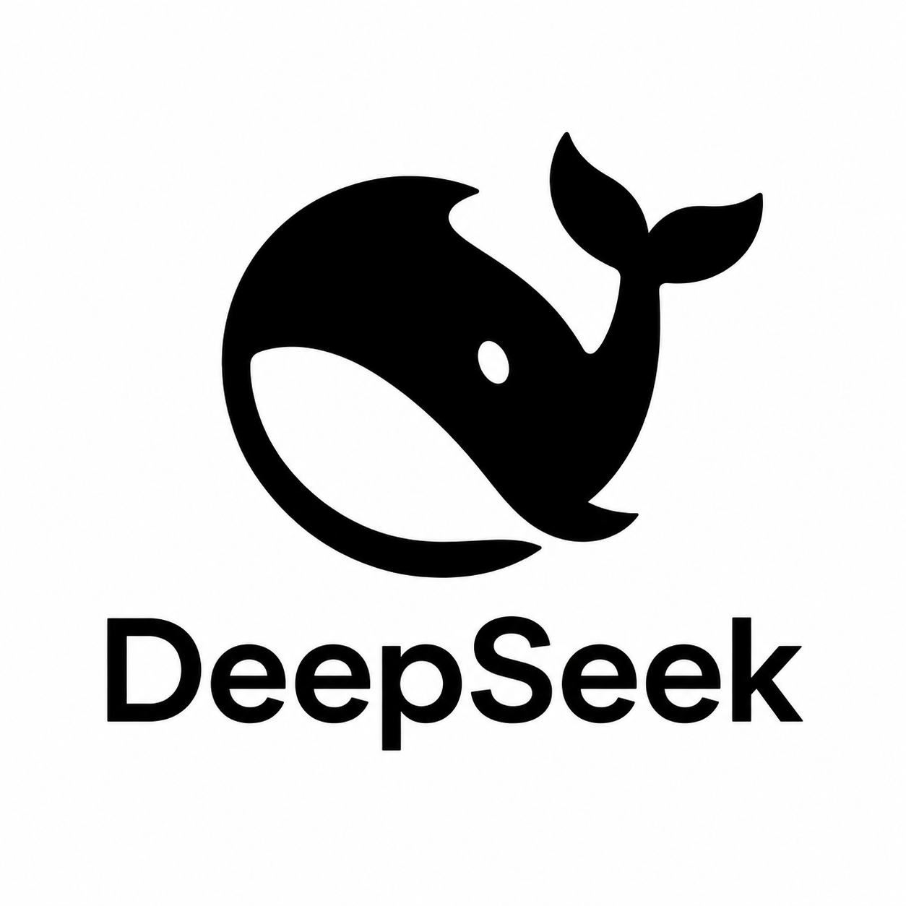

<p align="center">
  
</p>

# DeepSeek Harness Desktop

[English](README.md)

这是 [DeepSeek Harness 官方开源项目](https://github.com/deepseek-ai/deepseek-harness)的非官方桌面封装，支持 Windows 和 macOS。安装包内置 DeepSeek Harness `0.1.0-rc.6`、Electron 和运行依赖，普通用户无需另外安装 Node.js、pnpm 或源码依赖。

本封装由社区独立维护，不是 DeepSeek 官方产品。DeepSeek Harness 本身仍处于开发者预览阶段，后续版本可能存在不兼容变化。

## 下载

从 [GitHub Releases](https://github.com/dadaozei01/deepseek-harness-desktop/releases) 下载对应安装包和 `SHA256SUMS.txt`：

- Windows 10/11 x64：`DeepSeek-Harness-Desktop-0.1.1-Windows-x64.exe`
- Apple Silicon Mac：`DeepSeek-Harness-Desktop-0.1.1-macOS-arm64.dmg`
- Intel Mac：`DeepSeek-Harness-Desktop-0.1.1-macOS-x64.dmg`

当前版本没有代码签名。请按照 [Windows 安装说明](docs/INSTALL_WINDOWS.md)或 [macOS 安装说明](docs/INSTALL_MACOS.md)中的安全步骤操作。

## 与官方源码的区别

[官方仓库](https://github.com/deepseek-ai/deepseek-harness)包含 Harness CLI、Web UI、插件和完整开发源码。本仓库只增加：

- 一个小型、加固过的 Electron 窗口；
- 自动在 `127.0.0.1` 回环地址启动本地服务；
- 固定并内置运行依赖；
- Windows 与 macOS 安装包；
- 原生架构 CI 构建和 SHA-256 校验文件。

本项目不修改、不替换官方 Harness 的核心业务逻辑。

## 首次使用

1. 安装并启动应用。
2. 在 Harness 设置界面配置受支持的模型服务商。
3. 选择或新建工作区，然后开始对话。

模型密钥由 Harness 自己保存在本地配置中；Electron 外壳不会读取、上传或记录 API Key。

## 本地数据与隐私

Harness 通常把用户配置、凭据、会话等数据保存在用户主目录下的 `.dsh`：

- Windows：`%USERPROFILE%\.dsh`
- macOS：`$HOME/.dsh`

卸载桌面应用不会自动删除这些数据；如需彻底清理，请先备份，再单独删除。Web UI 只监听 `127.0.0.1`，不会向局域网开放。

## 从源码构建

需要 Node.js 22+、pnpm 11.7.0，并在目标原生系统上构建安装包。

```bash
pnpm install --frozen-lockfile
pnpm test
pnpm run typecheck
pnpm run build
```

原生安装包命令：

```bash
pnpm run dist:win
pnpm run dist:mac:arm64
pnpm run dist:mac:x64
```

macOS arm64 与 x64 版本分别由对应架构的 GitHub Runner 构建。完整发布流程见 [RELEASING.md](docs/RELEASING.md)。

## 许可与安全

桌面封装代码使用 [MIT License](LICENSE)。内置项目保留各自许可证，详见 [THIRD_PARTY_NOTICES.md](THIRD_PARTY_NOTICES.md)。安全问题请按 [SECURITY.md](SECURITY.md) 私密报告，不要在公开 Issue 中粘贴密钥。
